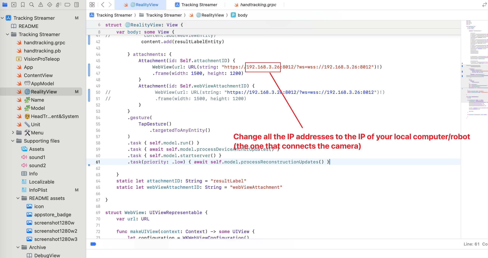
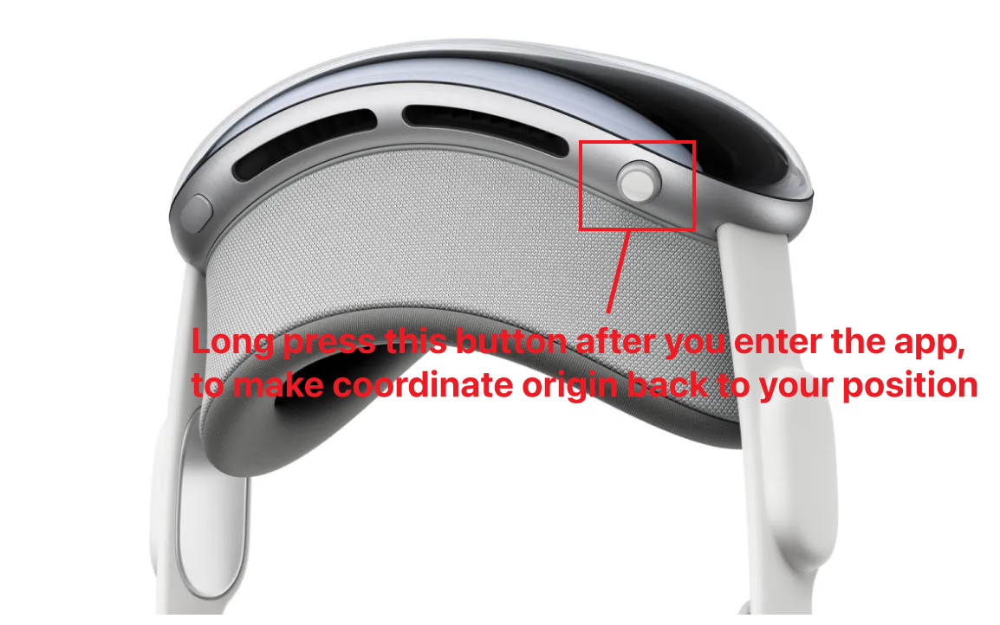

# Apple Vision Pro APP for Humanoid Manipulation

This APP is the part of the project [Generalizable Humanoid Manipulation with Improved 3D Diffusion Policy](https://humanoid-manipulation.github.io).


# Install on your Vision Pro 

## Prerequisites

- Mac with Xcode 15 [[Install here]](https://apps.apple.com/us/app/xcode/id497799835?mt=12/)
- Apple Vision Pro  [[Buy Here]](https://www.apple.com/apple-vision-pro/)
- Apple Developer Program Account  [[Register Here]](https://developer.apple.com/)
- Vision Pro Developer Strap  [[Buy Here]](https://developer.apple.com/visionos/developer-strap/)


## Installing the App


### Step 1. Open Xcode Project

After you `git cloned` the project, double click `TrackingStreamer.xcodproj`. This will automatically open up Xcode where you can install the app. 


### Step 2. Register your developer account


On the left side bar, click on `VisionProTeleop`. Under Targets - Signing & Capabilities - Team, click `Add an Account` and follow the steps to add your Apple Developer Account. Then, change the `Bundle Identifier` to a unique name of yours. 

### Step 3. Connect Apple Vision Pro to your Mac

Using the Vision Pro [Developer Strap](https://developer.apple.com/visionos/developer-strap/), connect your Apple Vision Pro to your Mac. When you're first connecting, Mac will take some time to configure things. When things are ready, you can see Apple Vision Pro appearing to as one of the possible destinations to install. 


Before starting to install, change the IP address to the IP of your computer/robot, the one that connects with the camera. For example, my robot's IP is "192.168.31.157". Then I need to change all "192.168.3.26" into  "192.168.31.157".



Then, click the `play` button to start installing. If everrything went well, you will see "Build Succeeded". 

### Step 4. Enjoy the App! 

Once you've successfully installed the App, you can disconnect the Vision Pro from your Mac, and use it as a standalone device/app without the Mac. You will see an App Icon on your home screen. Click on the icon to run the app and start streaming. 


# Local Vision Streaming

Apple does not allow WebXR on non-https connections. To test the application locally, we need to create a self-signed certificate and install it on the client. You need a ubuntu machine and a router. Connect the VisionPro and the ubuntu machine to the same router. 
1. install mkcert: https://github.com/FiloSottile/mkcert
2. check local ip address: 

```
ifconfig | grep inet
```
Suppose the local ip address of the ubuntu machine is `192.168.31.157`.

3. create certificate: 

```
mkcert -install && mkcert -cert-file cert.pem -key-file key.pem 192.168.31.157 localhost 127.0.0.1
```

4. open firewall on server
```
sudo iptables -A INPUT -p tcp --dport 8012 -j ACCEPT
sudo iptables-save
sudo iptables -L
```
or can be done with `ufw`:
```
sudo ufw allow 8012
```
Note: You should put `cert.pem` and `key.pem` in the folder of the real robot (`real_robot/scripts`). A python usage would look like:
```python
self.app = Vuer(host='0.0.0.0', cert="./cert.pem", key="./key.pem")
```

6. install ca-certificates on VisionPro
```
mkcert -CAROOT
```
Copy the rootCA.pem via AirDrop to VisionPro and install it.

Settings > General > About > Certificate Trust Settings. Under "Enable full trust for root certificates", turn on trust for the certificate.

settings > Apps > Safari > Advanced > Feature Flags > Enable All WebXR Related Features

7. open the browser on Safari on VisionPro and go to `https://192.168.31.157:8012?ws=wss://192.168.31.157:8012`

8. Click `Enter VR` and ``Allow`` to start the VR session.


# Usage
Before using the app, you should make sure the program is running on the robot side. Please refer to the real robot part of HUMANI.

1. Enter the app. Ensure your robot (together with the camera) is in the same local network with your AVP.

2. Remember to press the home button, to adjust the coordinate system.
3. Snap your left hand to start the teleoperation
4. End the teleoperation by again snapping your left hand.





# Acknowledgment

The APP is mainly built upon [VisionProTeleop](https://github.com/Improbable-AI/VisionProTeleop) and [TeleVision](https://github.com/OpenTeleVision/TeleVision). If you have further questions, please contact Wenhao Wang by wwenhao@seas.upenn.edu

# License

[VisionProTeleop](https://github.com/Improbable-AI/VisionProTeleop) is under the MIT license. [TeleVision](https://github.com/OpenTeleVision/TeleVision) is under the Apache License 2.0. This project is under the MIT license.


